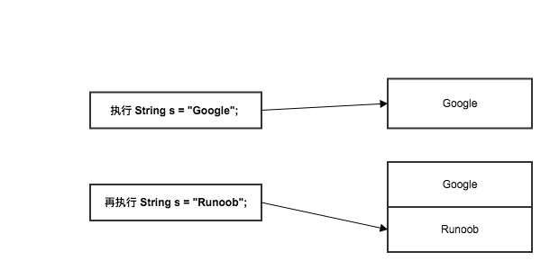
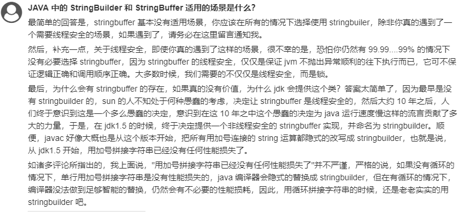

# Java String StringBuilder StringBuffer

## String 类
String 类是不可改变的解析

```java
String s = "Google";
System.out.println("s = " + s);

s = "Runoob";
System.out.println("s = " + s);
```
结果：
```
Google
Runoob
```
结果看起来是改变了，但实际上并没有，
原因在于实例中的 **s** 只是一个 **String** 对象的引用，并不是对象本身，当执行 **s = "Runoob";** 创建了一个新的对象 "Runoob"，而原来的 "Google" 还存在于内存中。




**String 不可逆源码分析**

```java
public final class String
    implements java.io.Serializable, Comparable<String>, CharSequence {
    /** The value is used for character storage. */
    private final char value[];
```
* 字符串实际上就是一个 char 数组，并且内部就是封装了一个 char 数组。并且这里 char 数组是被 final 修饰的:
* 并且 String 中的所有的方法，都是对于 char 数组的改变，只要是对它的改变，方法内部都是返回一个新的 String 实例


```java
String s1 = "abc";            // 常量池
String s2 = new String("abc");     // 堆内存中
System.out.println(s1==s2);        // false两个对象的地址值不一样。
System.out.println(s1.equals(s2)); // true
```

```java
String s1="a"+"b"+"c";
String s2="abc";
System.out.println(s1==s2);             // true  
System.out.println(s1.equals(s2));      // true
```
java 中常量优化机制，编译时 s1 已经成为 **abc** 在常量池中查找创建，s2 不需要再创建。


```java
String s1="ab";
String s2="abc";
String s3=s1+"c";
System.out.println(s3==s2);         // false
System.out.println(s3.equals(s2));  // true
```
先在常量池中创建 `ab`， 地址指向s1， 在在常量池中创建 `abc`， 地址指向s2， 对于s3， 先隐性的创建StringBuilder对象，在调用StringBuilder对象的append方法得到 `abc`，
再调用toString方法转化得到结果指向s3，因此为false


### API


## StringBuilder && StringBuffer

StringBuffer 和 StringBuilder 类的对象能够被多次的修改，并且不产生新的未使用对象。

### API

StringBuilder 对象方法

| 序号 | 方法描述                                                                                      |
|---|---------------------------------------------------------------------------|
| 1 | `public StringBuffer append(String s)` 将指定的字符串追加到此字符序列。                     |
| 2 | `public StringBuffer reverse()` 将此字符序列用其反转形式取代。                             |
| 3 | `public delete(int start, int end)` 移除此序列的子字符串中的字符。                         |
| 4 | `public insert(int offset, int i)` 将 `int` 参数的字符串表示形式插入此序列中。                |
| 5 | `replace(int start, int end, String str)` 使用给定 `String` 中的字符替换此序列的子字符串中的字符。 |


| 序号 | 方法描述                                                                                      |
|----|-------------------------------------------------------------------------------------------|
| 1  | `int capacity()` 返回当前容量。                                                                    |
| 2  | `char charAt(int index)` 返回此序列中指定索引处的 `char` 值。                                             |
| 3  | `void ensureCapacity(int minimumCapacity)` 确保容量至少等于指定的最小值。                                  |
| 4  | `void getChars(int srcBegin, int srcEnd, char[] dst, int dstBegin)` 将字符从此序列复制到目标字符数组 `dst`。 |
| 5  | `int indexOf(String str)` 返回第一次出现的指定子字符串在该字符串中的索引。                                          |
| 6  | `int indexOf(String str, int fromIndex)` 从指定的索引处开始，返回第一次出现的指定子字符串在该字符串中的索引。                 |
| 7  | `int lastIndexOf(String str)` 返回最右边出现的指定子字符串在此字符串中的索引。                                      |
| 8  | `int lastIndexOf(String str, int fromIndex)` 返回 String 对象中子字符串最后出现的位置。                      |
| 9  | `int length()` 返回长度（字符数）。                                                                   |
| 10 | `void setCharAt(int index, char ch)` 将给定索引处的字符设置为 `ch`。                                     |
| 11 | `void setLength(int newLength)` 设置字符序列的长度。                                                  |
| 12 | `CharSequence subSequence(int start, int end)` 返回一个新的字符序列，该字符序列是此序列的子序列。                    |
| 13 | `String substring(int start)` 返回一个新的 `String`，它包含此字符序列当前所包含的字符子序列。                          |
| 14 | `String substring(int start, int end) `返回一个新的 `String`，它包含此序列当前所包含的字符子序列。                   |
| 15 | `String toString()` 返回此序列中数据的字符串表示形式。                                                       |


## 对比

* String: String 是被 final 修饰的，他的长度是不可变的，就算调用 String 的 concat 方法，那也是把字符串拼接起来并重新创建一个对象,把拼接后的 String 的值赋给新创建的对象
* StringBuilder: 长度可变，速度快，线程不安全，String在 `+`运算时，会隐式调用StringBuilder方法。
* StringBuffer： 一个尴尬的设计，跟StringBuilder方法一样，区别在于线程安全





