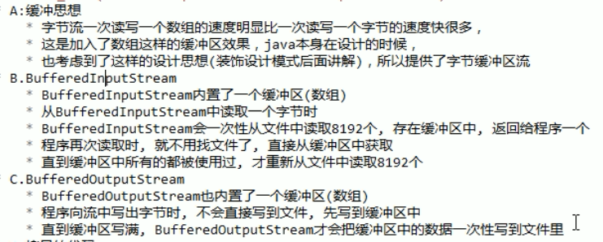

---
title：IO流
data: 2019-01-11 19:13:14   
tags: java
---
    
# IO流


## 字节流

### FileInputStream
读取文件字节流

* **read方法返回值为什么是`int`**


### FileOutputStream

* 在创建对象的时候，如果没有这个文件会创建出来
* 如果有这个文件，会将这个文件清空再写入

注意在创建 `FileOutputStream`对象时，区分不同参数的构造函数，表达的意思不一样

### 应用

**拷贝**
```java
// 第一种方式，一个一个字节的读写，效率非常低
public void copy(){
    FileInputStream fis = new FileInputStream("base.jpg");
    FileOutputStream fos = new FileOutputStream("copy.jpg");
    
    int b ; 
    while( (b= fis.read()) != -1){
        fos.write(b)
    }
    
    fis.close();
    fos.close();
}
```

```java
// 第二种方式，将整个文件字节读取放到byte数组，再一次写掉，
// 小文件还好，大文件内存根本吃不消，不推荐
public void copy(){
    FileInputStream fis = new FileInputStream("base.jpg");
    FileOutputStream fos = new FileOutputStream("copy.jpg");
    
    byte[] arr = new Byte[fis.available()];
    fis.read(arr);
    fos.wirte(arr);
    
    fis.close();
    fos.close();
}
```


```java
// 第三种方式，定义小数组，数组大小合适，
public void copy(){
    FileInputStream fis = new FileInputStream("base.jpg");
    FileOutputStream fos = new FileOutputStream("copy.jpg");
    
    byte[] arr = new Byte[1024 * 8];
    int len ;
    while((len = fis.read(arr)) != -1){
        fos.wirte(arr,0, len);
    }
    
    fis.close();
    fos.close();
}
```


#### buffer缓存



```java
// 最终方法，使用 BufferInputStream 和 BufferOutputStream 装在内存，内存效率高，
public void copy(){
    FileInputStream fis = new FileInputStream("base.jpg");
    FileOutputStream fos = new FileOutputStream("copy.jpg");
    BufferInputStream bis = new BufferInputStream(fis);
    BufferOutputStream bos = new BufferOutputStream(fos);
    
    int b ;
    while((b = bis.read()) != -1){
        bos.wirte(b);
    }
    
    bis.close();
    bos.close();
}
```

和小数组相比，谁更快：

小数组更快，因为小数组读写都是同一个数组， buffer定义了两个数组input和output。


#### close && flush

* close： 具备刷新的功能，在关闭流之前，会先刷新 一次缓冲区，将缓冲区的字节全部刷新到文件上，在关闭流。刷新完之后就不能写了
* flush： 具备刷新功能，刷新完之后还可以继续写

#### 字节流读写中文
* 读： 一个中文占用两个字节，标点符号为一个字节，在读取中有时候可能会读取到半个中文，造成乱码
* 写：字节流直接操作的字节，将字符串直接转换为字节数组。

#### 文件加密
* 加密： 在写文件时，将每次写入的字节异或上一个数（密码），即可完成加密
* 解密： 重新读取文件，按照之前的方式同样再异或这个数（密码），完成解密


## 字符流
字符流读取数据，先读取到字节数据，然后转化为字符；如果要写出数据，需要把字符转化为字节再写出。

### FileReader && FileWriter

字符流能拷贝非纯文本文件吗？

* 不能，因为在读的时候会将字节转换为字符，在转换过程中，可能找不到对应的字符，就会用 `?`代替，写的时候会将字符换成字节写出去。
* 如果是 `？`,直接写出，这样文件就乱码了

* readLine()： 读取一行，读至行末返回null
* newLine() ： 添加换行符
  * 与 `write(\r\n)`的区别
    * newLine()是跨平台的区别
    * `write(\r\n)`只支持window系统

